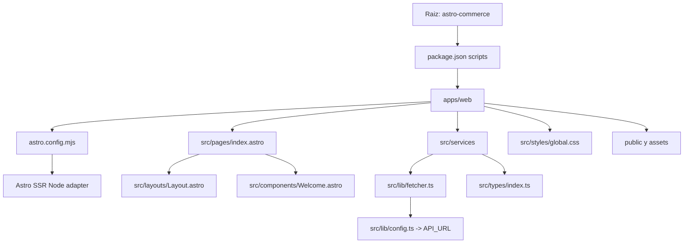

## Infraestructura general

- Proyecto Astro en `astro-commerce/apps/web` con salida `server` y adaptador Node en modo `standalone`.
- Frontend consume un API externo; la URL base viene de `import.meta.env.PUBLIC_API_URL` y tiene fallback a `http://localhost:4000/api`.

## Instalacion de librerias y requerimientos (consola)

Requerimientos minimos del proyecto:

- Node.js `>=22.12.0` (definido en `astro-commerce/apps/web/package.json`).
- npm como gestor (existe `package-lock.json`).
- Variable `PUBLIC_API_URL` si se requiere un API distinto al default.

Pasos en consola (PowerShell):

1. `cd astro-commerce/apps/web`
2. `node -v` (validar que cumple `>=22.12.0`)
3. `npm -v` (validar que npm esta disponible)
4. `npm install` (instala dependencias segun `package-lock.json`)
5. Para nuevas librerias:
   - `npm install <paquete>` (dependencia de runtime)
   - `npm install -D <paquete>` (dependencia de desarrollo)

## Validaciones y pruebas (actualizacion y kernels)

Validaciones paso a paso para confirmar que todo este actualizado y que el runtime corresponde:

1. `node -v` debe cumplir `>=22.12.0`.
2. `node -p "process.platform + ' ' + process.arch"` debe coincidir con el entorno (ej. `win32 x64`).
3. `npm install` no debe cambiar `package-lock.json` si todo esta sincronizado.
4. `npm ls --depth=0` debe listar dependencias sin errores.
5. `npm outdated` muestra si hay versiones nuevas; si aparece salida, decidir si actualizar.

Pruebas funcionales minimas:

1. `npm run build` para validar el build SSR.
2. `npm run preview` para validar el bundle generado.
3. `npm run dev` para smoke test local y revisar la pagina principal.

## Estructura y correspondencia de archivos

- `astro-commerce/apps/web/astro.config.mjs`: configura el runtime (SSR server) y el adaptador Node.
- `astro-commerce/apps/web/src/pages/index.astro`: pagina principal; orquesta el layout y el componente inicial.
- `astro-commerce/apps/web/src/layouts/Layout.astro`: layout HTML base (head + body + slot).
- `astro-commerce/apps/web/src/components/Welcome.astro`: componente UI de bienvenida (contenido y estilos locales).
- `astro-commerce/apps/web/src/services/auth.ts`: servicios de autenticacion (login y registro).
- `astro-commerce/apps/web/src/services/products.ts`: servicios de productos (listar, detalle, crear).
- `astro-commerce/apps/web/src/lib/fetcher.ts`: wrapper de `fetch` con headers JSON y manejo de errores.
- `astro-commerce/apps/web/src/lib/config.ts`: fuente de configuracion para `API_URL`.
- `astro-commerce/apps/web/src/types/index.ts`: contratos de datos (`user`, `product`, `authResponse`).
- `astro-commerce/apps/web/src/styles/global.css`: sistema de estilos global (tokens, layout, utilidades).

## Flujo de ejecucion (coherencia de codigo)

1. Astro inicia con `astro.config.mjs` y levanta el servidor Node.
2. Al solicitar la ruta `/`, se renderiza `src/pages/index.astro`.
3. `index.astro` compone `Layout.astro` y el componente `Welcome.astro`.
4. Los componentes UI pueden consumir datos via servicios en `src/services/*`.
5. Cada servicio delega la peticion HTTP a `apiFetch` en `src/lib/fetcher.ts`.
6. `apiFetch` arma la URL con `API_URL`, agrega headers JSON y propaga errores HTTP.
7. Las respuestas tipadas se describen en `src/types/index.ts` para mantener coherencia.

## Modulos y logica de negocio

### `auth.ts`
- `loginUser(email, password)`: POST a `/auth/login`, retorna `authResponse`.
- `registerUser(name, email, password)`: POST a `/auth/register`, retorna `authResponse`.
- Ambas funciones dependen de `apiFetch` para consistencia de headers y errores.

### `products.ts`
- `getProducts()`: GET a `/products`, retorna `product[]`.
- `getProduct(id)`: GET a `/products/{id}`, retorna `product`.
- `createProduct(product)`: POST a `/products`, retorna `product`.
- Mantiene el mismo contrato de tipos y el mismo wrapper HTTP.

### `fetcher.ts`
- Centraliza la logica de red para evitar duplicacion en servicios.
- Inserta `Content-Type: application/json` y `Authorization` si se pasa `token`.
- Lanza error cuando `response.ok` es falso para un flujo de error uniforme.

## Estilos y presentacion

- `global.css` define tokens (`--primary`, `--text`, `--radius`, etc.) y utilidades (`.grid`, `.btn`, `.card`).
- Los estilos locales del componente `Welcome.astro` permanecen encapsulados, mientras lo global aporta consistencia visual.

## Notas de coherencia y mantenimiento

- Los servicios deben seguir usando `apiFetch` para mantener el mismo manejo de errores.
- Los tipos en `src/types/index.ts` son la fuente unica de verdad para respuestas del API.
- Cualquier nueva pagina debe componer `Layout.astro` para mantener el HTML base.

## Estado actual del repositorio (vision general)

- El repositorio es un monorepo simple con carpeta raiz `astro-commerce`.
- En la raiz existe `package.json` con scripts para orquestar la app web y una app API futura o paralela.
- La aplicacion actual vive en `astro-commerce/apps/web` y es un proyecto Astro SSR con adaptador Node.
- `public/` contiene assets estaticos (favicons) y `src/assets/` contiene SVGs usados por el componente `Welcome.astro`.
- `src/` concentra layouts, componentes, paginas, estilos globales y servicios para consumo de API.

## Detalle de codigo por archivo (estado actual)

### `astro-commerce/package.json`
- Define scripts de orquestacion (`dev:web`, `build:web`) apuntando a `apps/web`.
- Sirve como punto de entrada para ejecutar comandos sin salir de la raiz.

### `astro-commerce/apps/web/package.json`
- Declara el runtime Astro, el adaptador Node y scripts `dev`, `build`, `preview`.
- Fija la version minima de Node en `>=22.12.0` para evitar inconsistencias de runtime.

### `astro-commerce/apps/web/astro.config.mjs`
- Configura la salida `server` (SSR) y el adaptador Node en modo `standalone`.
- Centraliza la estrategia de despliegue para el frontend.

### `astro-commerce/apps/web/src/pages/index.astro`
- Punto de entrada de la ruta `/`.
- Compone `Layout.astro` y el componente `Welcome.astro`.
- Se mantiene minimal para permitir sustitucion rapida por la pagina real.

### `astro-commerce/apps/web/src/layouts/Layout.astro`
- Define HTML base, meta tags y el `slot` principal.
- Es el contenedor comun para todas las paginas.

### `astro-commerce/apps/web/src/components/Welcome.astro`
- UI inicial de Astro con assets `astro.svg` y `background.svg`.
- Incluye estilos locales encapsulados para la pagina de bienvenida.

### `astro-commerce/apps/web/src/lib/config.ts`
- Fuente unica de configuracion de `API_URL`.
- Usa `PUBLIC_API_URL` cuando existe; fallback a `http://localhost:4000/api`.

### `astro-commerce/apps/web/src/lib/fetcher.ts`
- Wrapper de red `apiFetch` con headers JSON y auth opcional.
- Consolida manejo de errores HTTP y parseo JSON.
- Permite tipado generico con `apiFetch<T>()`.

### `astro-commerce/apps/web/src/services/auth.ts`
- `loginUser(email, password)` consume `/auth/login`.
- `registerUser(name, email, password)` consume `/auth/register`.
- Ambas funciones usan `apiFetch` para consistencia de headers y errores.

### `astro-commerce/apps/web/src/services/products.ts`
- `getProducts()` obtiene lista de productos.
- `getProduct(id)` obtiene detalle de un producto.
- `createProduct(product)` crea un producto via POST.
- Todas las funciones quedan tipadas por `product` desde `src/types`.

### `astro-commerce/apps/web/src/types/index.ts`
- Define los contratos de datos `user`, `product`, `authResponse`.
- Centraliza el tipado para servicios y posibles componentes.

### `astro-commerce/apps/web/src/styles/global.css`
- Tokens globales de color, tipografia y espaciados.
- Utilidades base (`.container`, `.grid`, `.btn`, `.card`, `.hero`, `.nav`).
- Estilos estructurales para secciones, tarjetas, header y dashboard.

### `astro-commerce/apps/web/src/env.d.ts`
- Declara tipos de Astro para permitir `import.meta.env` y tipado global.

### `astro-commerce/apps/web/tsconfig.json`
- Extiende la configuracion estricta de Astro.
- Incluye tipados generados y excluye `dist`.

### `astro-commerce/apps/web/.gitignore`
- Ignora `dist`, `.astro`, `node_modules` y archivos `.env`.
- Evita artefactos de build y datos sensibles en el repositorio.

### `astro-commerce/apps/web/.vscode/extensions.json`
- Recomienda la extension oficial `astro-build.astro-vscode`.

### `astro-commerce/apps/web/.vscode/launch.json`
- Configura lanzamiento del servidor de desarrollo desde VS Code.

### `astro-commerce/apps/web/README.md`
- Plantilla base del starter de Astro con comandos y estructura.

## Flujograma de construccion del repositorio

## Flujo de datos y responsabilidades (codigo actual)

1. La pagina `/` renderiza `index.astro`, que compone `Layout.astro` y `Welcome.astro`.
2. Cuando una pagina o componente necesita datos, llama a un servicio en `src/services`.
3. Los servicios delegan en `apiFetch` para construir la URL y definir headers.
4. `apiFetch` usa `API_URL` desde `config.ts` y retorna JSON tipado.
5. Los contratos de datos viven en `src/types/index.ts` y se reutilizan en servicios y UI.

## Cambios y decisiones actuales (estado del codigo)

- Se adopto Astro SSR con adaptador Node `standalone` para permitir deploy server-side.
- Se centralizo la configuracion del API en `config.ts` para evitar hardcode en servicios.
- Se agrego un wrapper `apiFetch` para unificar errores y headers JSON.
- Se definieron tipos de dominio base (`user`, `product`, `authResponse`) para consistencia.
- Se establecio un sistema de estilos global para base visual comun.
